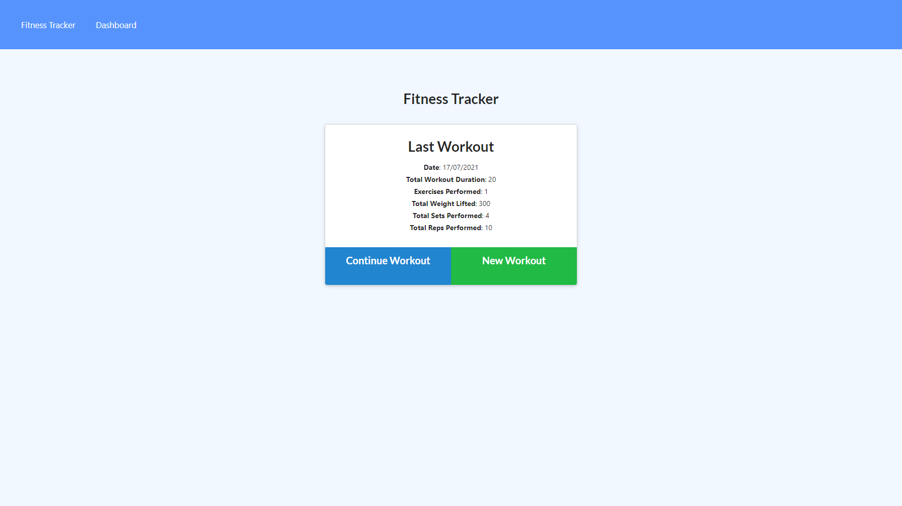

## Workout Tracker

<h2> Table of Contents </h2>

- [Project Link](#project-link)
- [Description](#description)
- [User Story](#user-story)
- [What did we do](#what-did-we-do)
- [Screenshots](#screenshots)

## Project Link

Click [here](https://github.com/PDUBB3/tech-blog-mvc.git) to view project on Github repository.
Click [here](https://damp-sea-93095.herokuapp.com) to view project on Heroku

## Description

In this project, I have built a workout tracker by using front end code and creating a Mongo database with a Mongoose schema and handle routes with express.

## User Story

As a user, I want to be able to view create and track daily workouts. I want to be able to log multiple exercises in a workout on a given day. I should also be able to track the name, type, weight, sets, reps, and duration of exercise. If the exercise is a cardio exercise, I should be able to track my distance traveled.

## What did we do?

I have created a work out tracker, where I am able to do the following:

- [x] When the page is loaded, an option to create a new workout or continue with the last workout is given.
- [x] Add exercises to the most recent workout plan.
- [x] Add new exercises to a new workout plan.
- [x] View the combined weight of multiple exercises from the past seven workouts on the stats page.
- [x] View the total duration of each workout from the past seven workouts on the stats page.

## Getting started

- Create a new GitHub repository called workout-tracker
- Clone github project onto your local machine
- Navigate into the project
- Open the project into VS code

```
git clone git@github.com:PDUBB3/workout-tracker.git
cd readme-generator
code .
```

- Repo to include a `package.json` file by running `npm init -y` when you first set up the project.
- Add `start` script to `package.json`
- Create a `seed.sql` file to pre-populate our database
- Use `scheme.sql` filed in the `db` folder to create database with MySQL commands and use environmental variables to store sensitive data.

Installation

```
npm i

```

Run

```
npm run start
npm run dev
npm run seed

```

## Screenshot


